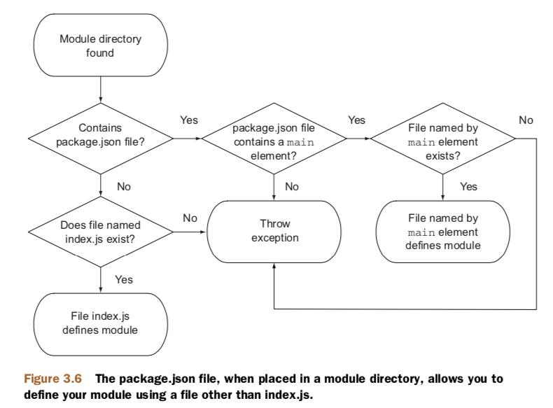

# NPlayground

### 20191125
***
#### No.1 layers of a Node Web Application
---- layer 3: Application logic (http.createServer(), app.use()) + Route handlers, Directory structures, Business algorithms

---- layer 2: Community modules (e.g. express, mongoose, etc.) + db drivers, Middleware, Routing

---- layer 1: Node core (e.g. querystring, http, net) + Low-level HTTP parser, Low-level TCP server

### 20190911
***
#### No.1 flow control
The concept of sequencing groups of asynchronous tasks is called flow control. There are two types of flow control: serial and parallel.

Tasks that need to happen one after the other are called serial. 

Tasks that don't need to happen one after the other are called parallel. 

### 20190910
***
#### No.1 something about Node's event loop
Node's event loop keeps track of asynchronous logic that hasn't completed processing. As long as there's uncompleted asynchronous logic, the Node process won't exit.


### 20190828
***
#### No.1 A note about require and synchronous I/O
require is one of the few synchronous I/O operations available in Node. Because modules are used often and are typically included at the top of a file, having require be synchronous helps keep code clean, ordered, and readable.

But avoid using require in I/O-intensive parts of your application. Any synchronous call will block Node from doing anything until the call has finished. For example, if you're running an HTTP server, you would take a performance hit if you used require on each incoming request. This is typically why require and other synchronous operations are used only when the application initially loads.

#### No.2 What really gets exported
If you create a module that populates both `exports` and `module.exports`, `module.exports` will be returned and `exports` will be ignored.

What ultimately gets exported in your application is `module.exports`. `exports` is set up simply as a global reference to `module.exports`, which initially is defined as an empty object that you can add properties to. So for example, `exports.myFunc` is just shorthand for `module.exports.myFunc`.

As a result, if `exports` is set to anything else, it breaks the reference between `module.exports` and `exports`. Because `module.exports` is what really gets exported, `exports` will no longer work as expected -- it doesn't reference module.exports anymore. If you want to maintain that link, you can make `module.exports` reference `exports` again as follows:

```javascript
module.exports = exports = Currency;
```
Beside from that, `exports` is inaccessible from outside, please see examples in [Sample.js](./basics/Sample.js)

#### No.3 Flow of finding a module

Steps of finding a module with node_modules:


How `package.json` defines a module:


First, if a module is a directory, the file in the module directory that will be evaluated must be named `index.js`, unless specified otherwise by a file in the module directory named `package.json`.

The other thing to be aware of is Node's ability to cache modules as objects. If two files in an applciation require the same module, the first require will store the data returned in application memory so the second require won't need to access and evaluate the module's source files.

